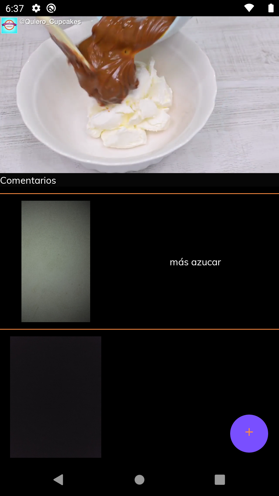
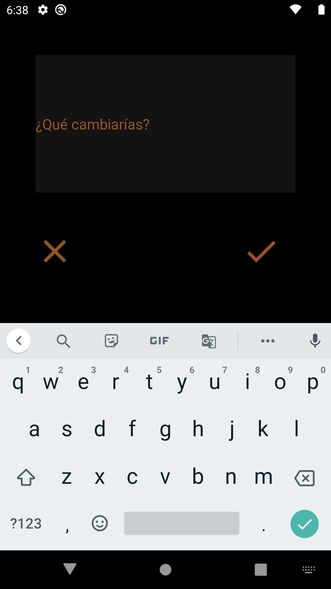
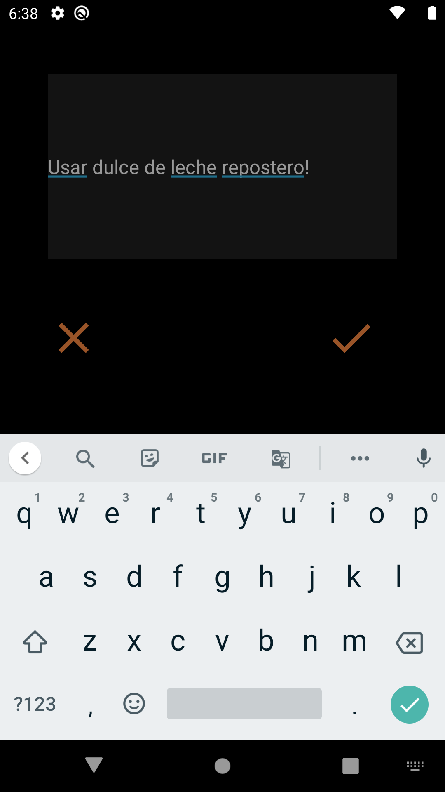

# CookingMate
Cooking Mate

# Introduccion
Cooking mate es una aplicacion que te ayudara a aprender a cocinar y a hacer recetas en simples y cortos pasos, compartiendo como familia, amigos y conocidos los resultados y como la sigue cada uno.

# Pantallas

### Feed principal
Tenemos un feed principal donde vemos las recetas disponibles

### Ingredientes
Tocando en **Ingredientes**, debajo de la imagen, podemos ver en detalle los ingredientes de cada receta.

### Historias de contactos
Debajo de la imagen principal de la receta, podemos ver la lista de historias que nuestros contactos fueron compartiendo sobre como cada uno de ellos la realizo. Tocando sobre alguna de las imagenes, podemos verlas.

### Agregar historia
Cuando no hay ninguna historia relacionada a una receta para ver y el usuario aun no ha subido la suya, vemos un mensaje incentivando a hacerlo:

### Ver receta
Si tocamos en la **Ver receta**, vamos a empezar a ver los pasos de cada receta, con los comentarios que otras personas fueron agregando a cada uno de los pasos junto con sus imagenes.

### Agregar comentario
Ti tocamos en el signo + durante uno de estos pasos, vamos a poder agregar una imagen relacionada a nuestro comentario

Y posteriormente que cambiariamos o hariamos distinto: 

